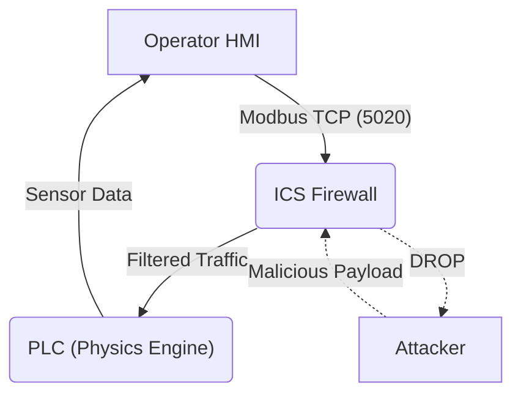

# SCADA Guardian // Industrial Control System Security Lab


**SCADA Guardian** is a realistic industrial control system (ICS) simulation designed to demonstrate security vulnerabilities and defenses in Critical Infrastructure. It features a physics-based Nuclear Reactor simulation (PLC), a futuristic Human-Machine Interface (HMI), and a Deep Packet Inspection (DPI) firewall.

> **Disclaimer**: This tool is for educational purposes only. It uses standard Modbus TCP protocols to simulate industrial environments.

---

## 🚀 Features

### 1. The Power Plant (Physics Engine)
*   **PLC Logic**: A Modbus TCP server (`plc_sim.py`) simulating a reactor's core.
*   **Physics Simulation**: 
    *   **Thermodynamics**: Temperature rises dangerously if the "Cooling Pump" is disabled.
    *   **Pressure Dynamics**: Random fluctuations requiring valve regulation.
*   **Safety Logic**: Auto-shutdown protocols if critical thresholds are exceeded.

### 2. Operator HMI (Python)
*   **Cyberpunk Dashboard**: A professional-grade GUI for operators.
*   **Real-Time Data**: Live visualization of Pressure/Temperature trends using `matplotlib` canvas.
*   **Control Systems**: Manual overrides for Cooling Pumps and Relief Valves.
*   **Event Logging**: Detailed audit trail of all actions and alerts.

### 3. Industrial Firewall (C)
*   **Modbus DPI**: A C-based packet filter (`firewall.c`) using `libnetfilter_queue`.
*   **Malware Blocking**: Inspects traffic for unauthorized Modbus Function Codes (e.g., stopping the PLC).

---

## 🛠️ Architecture



---

## 📦 Installation & Usage

### Prerequisites
*   **Python 3** (pymodbus, tkinter)
*   **Libraries**: `pip install pymodbus matplotlib`
*   **Linux** (for Firewall component)

### 1. Start the Power Plant (PLC)
This simulates the physics and Modbus server.
```bash
python plc_sim.py
```

### 2. Launch the Operator Dashboard (HMI)
Connects to the PLC to visualize and control the facility.
```bash
python hmi_gui.py
```

### 3. (Optional) Run the Firewall
To test defense, compile the C firewall (requires `libnetfilter_queue`).
```bash
gcc firewall.c -o firewall -lnetfilter_queue -lnfnetlink
sudo ./firewall
```

---

## 🎮 Scenarios

### Scenario A: The "Meltdown" (Attack)
1.  Run the HMI and observe stable temperatures.
2.  Turn **OFF** the "Cooling Pump".
3.  **Result**: Watch the Temperature Graph rise exponentially until the reactor SCRAMs (Emergency Shutdown).

### Scenario B: The "Defense"
1.  Enable the Firewall.
2.  Attempt to send an unauthorized "Stop" command or invalid register write.
3.  **Result**: The firewall inspects the Modbus packet and drops the malicious frames.

---

## 📸 Screenshots
*(Add HMI screenshots here)*

---

## ⚠️ Legal & Ethics
This software simulates industrial protocols. While safe to run in a lab, **never** connect these tools to real-world PLCs, SCADA networks, or operational technology (OT) environments without explicit authorization.
